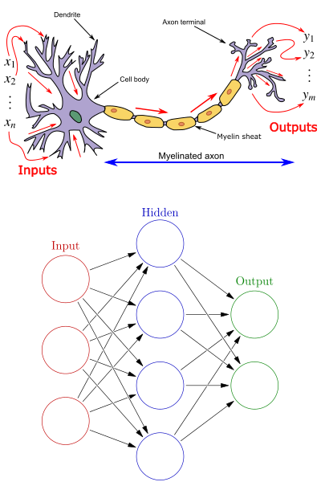
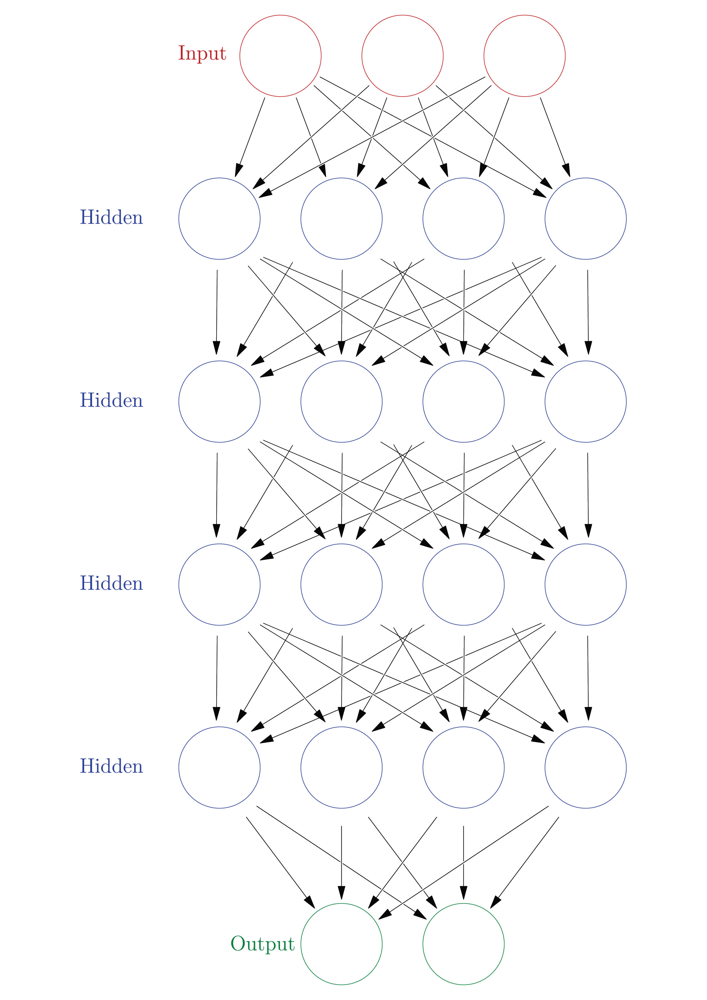
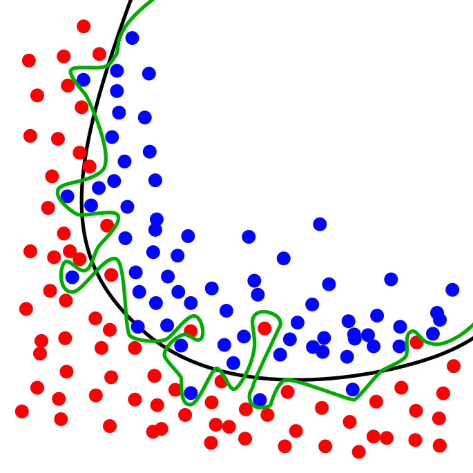

# Recap @ 601


## Previous lectures

- Introduction to R
- Data types
- Data wrangling
- Reproducibility
- Exploratory analysis
- Univariate analysis
    - Correlation
    - Regression


## Today

- Machine Learning
    - Definition
    - Types
- Unsupervised
    - Clustering
- In GIScience
    - Geodemographic classification


# Lecture 601<br/>Machine Learning


## Definition

<div class="columns-2">
*"The field of machine learning is concerned with the question of how to construct computer programs that automatically improve with experience."*

<font size="4">
Mitchell, T. (1997). Machine Learning. McGraw Hill.
</font>

<center>
{width=75%}
</center>

</div>

## Origines


- **Computer Science**: 
    - how to manually program computers to solve tasks

- **Statistics**:
    - what conclusions can be inferred from data

- **Machine Learning**:
    - intersection of **computer science** and **statistics**
    - how to get computers to **program themselves** from experience plus some initial structure
    - effective data capture, store, index, retrieve and merge 
    - computational tractability

<font size="4">
Mitchell, T.M., 2006. The discipline of machine learning (Vol. 9). Pittsburgh, PA: Carnegie Mellon University, School of Computer Science, Machine Learning Department.
</font>


## Types of machine learning

Machine learning approaches are divided into two main types

- **Supervised**
    - training of a *"predictive"* model from data
    - one attribute of the dataset is used to "predict" another attribute
    - e.g., classification

- **Unsupervised**
    - discovery of *descriptive* patterns in data
    - commonly used in data mining
    - e.g., clustering


## Supervised

<div class="columns-2">

- Training dataset
    - input attribute(s)
    - attribute to predict
- Testing dataset
    - input attribute(s)
    - attribute to predict
- Type of learning model
- Evaluation function
    - evaluates difference between prediction and output in testing data

<br/>

<center>
{width=90%}

<br/>
<font size="4">	
by Josef Steppan<br/>
via Wikimedia Commons,<br/>
CC-BY-SA-4.0
</font>
</center>

</div>

## Unsupervised

<div class="columns-2">

- Dataset
    - input attribute(s) to explore
- Type of model for the learning process
    - most approaches are iterative
    - e.g., hierarchical clustering
- Evaluation function
    - evaluates the quality of the pattern under consideration during one iteration


<center>
{width=90%}

<br/>
<font size="4">	
by Chire<br/>
via Wikimedia Commons,<br/>
CC-BY-SA-3.0
</font>
</center>

</div>


## ... more

- **Semi-supervised learning**
    - between unsupervised and supervised learning
    - combines a small amount of labelled data with a larger un-labelled dataset
    - continuity, cluster, and manifold (lower dimensionality) assumption

- **Reinforcement learning**
    - training agents take actions to maximize reward
    - balancing
        - exploration (new paths/options)
        - exploitation (of current knowledge)


## Neural networks

<div class="columns-2">

Supervised learning approach simulating simplistic neurons

- Classic model with 3 sets 
    - input neurons
    - output neurons
    - hidden layer
        - combines input values using **weights**
        - **activation function**
- The **traning algorithm** is used to define the best weights

<br/>

<center>
{width=70%}

<br/>
<font size="4">	
by Egm4313.s12 and Glosser.ca<br/>
via Wikimedia Commons,<br/>
CC-BY-SA-3.0
</font>
</center>

</div>


## Deep neural networks

<div class="columns-2">

Neural networks with **multiple hidden layers**

The fundamental idea is that *"deeper"* neurons allow for the encoding of more complex characteristics

<font size="4">	
**Example**: De Sabbata, S. and Liu, P. (2019). [Deep learning geodemographics with autoencoders and geographic convolution](https://www.researchgate.net/publication/334251358_Deep_learning_geodemographics_with_autoencoders_and_geographic_convolution). In proceedings of the 22nd AGILE Conference on Geographic Information Science, Limassol, Cyprus.
</font>

<br/>

<center>
{width=70%}

<br/>
<font size="4">	
derived from work by Glosser.ca<br/>
via Wikimedia Commons,<br/>
CC-BY-SA-3.0
</font>
</center>

</div>


## Convolutional neural networks

Deep neural networks with **convolutional hidden layers**

- used very successfully on image object recognition
- convolutional hidden layers *"convolve"* the images
    - a process similar to applying smoothing filters

<font size="4">	
**Example**: Liu, P. and De Sabbata, S. (2019). [Learning Digital Geographies through a Graph-Based Semi-supervised Approach](https://www.researchgate.net/publication/336021293_Learning_Digital_Geographies_through_a_Graph-Based_Semi-supervised_Approach). In proceedings of the 15th International Conference on GeoComputation, Queenstown, New Zealand.
</font>

<center>
{width=70%}

<br/>
<font size="4">	
by Aphex34 via Wikimedia Commons, CC-BY-SA-4.0
</font>
</center>


## Limits

<div class="columns-2">

- Complexity
- Training dataset quality
    - garbage in, garbage out
    
<center>
{width=80%}
</center>

<br/>

- Overfitting
    - creating a model perfect for the training data, but not generic enough to be useful

<center>
{width=50%}

<br/>
<font size="4">	
by Chabacano<br/>ia Wikimedia Commons,<br/>CC-BY-SA-4.0
</font>
</center>

</div>


# Lecture 601<br/>Clustering


## Clustering task

*"Clustering is an unsupervised machine learning task that automatically divides the data into* ***clusters*** *, or groups of similar items"*. (Lantz, 2019)

Methods:

- Centroid-based 
    - k-means
    - fuzzy c-means
- Hierarchical
- Mixed 
    - bootstrap aggregating
- Density-based
    - DBSCAN

## Example


```r
data_to_cluster <- data.frame(
  x_values = c(rnorm(40, 5, 1), rnorm(60, 10, 1), rnorm(20, 12, 3)),
  y_values = c(rnorm(40, 5, 1), rnorm(60, 5, 3), rnorm(20, 15, 1)),
  original_group = c(rep("A", 40), rep("B", 60), rep("C", 20)) )
```

<center>

</center>

## k-means

k-mean clusters `n` observations in `k` clusters, minimising the within-cluster sum of squares (WCSS)

<font size="4">	
**Algorithm**: `k` observations a randomly selected as initial centroids, then repeat

- **assignment step**: observations are assigned to the closest centroids
- **update step**: calculate means for each cluster to use as new the centroid

until centroids don't change anymore, the algorithm has **converged**
</font>


```r
kmeans_found_clusters <- data_to_cluster %>%
  select(x_values, y_values) %>%
  kmeans(centers=3, iter.max=50)

data_to_cluster <- data_to_cluster %>%
  add_column(kmeans_cluster = kmeans_found_clusters$cluster)
```

## K-means result

<div class="columns-2">


</div>

## Fuzzy c-means

Fuzzy c-means is similar to k-means but allows for *"fuzzy*" membership to clusters

Each observation is assigned with a value per each cluster

- usually from `0` to `1`
- indicates how well the observation fits within the cluster
- i.e., based on the distance from the centroid


```r
library(e1071)

cmeans_result <- data_to_cluster %>%
  select(x_values, y_values) %>%
  cmeans(centers=3, iter.max=50)

data_to_cluster <- data_to_cluster %>%
  add_column(c_means_assigned_cluster = cmeans_result$cluster)
```

## Fuzzy c-means

A *"crisp"* classification can be created by picking the highest membership value.

- that also allows to set a membership threshold (e.g., `0.75`)
- leaving some observations without a cluster


```r
data_to_cluster <- data_to_cluster %>%
  add_column(
    c_means_membership = apply(cmeans_result$membership, 1, max)
  ) %>%
  mutate(
    c_means_cluster = ifelse(
      c_means_membership > 0.75, 
      c_means_assigned_cluster, 
      0
    )
  )
```

## Fuzzy c-means result

<div class="columns-2">


</div>

## Hierarchical clustering

<font size="4">	
**Algorithm**: each object is initialised as, then repeat

- join the two most similar clusters based on a distance-based metric
- e.g., Ward's (1963) approach is based on variance

until only one single cluster is achieved
</font>


```r
hclust_result <- data_to_cluster %>%
  select(x_values, y_values) %>%
  dist(method="euclidean") %>%
  hclust(method="ward.D2")

data_to_cluster <- data_to_cluster %>%
  add_column(hclust_cluster = cutree(hclust_result, k=3))
```

## Clustering tree

This approach generates a clustering tree (dendrogram), which can then be *"cut"* at the desired height


```r
plot(hclust_result) + abline(h = 30, col = "red")
```


```
## integer(0)
```

## Hierarchical clustering result

<div class="columns-2">


</div>


## Bagged clustering

Bootstrap aggregating (*b-agg-ed*) clustering approach (Leisch, 1999)

- first k-means on samples
- then a hierarchical clustering of the centroids generated through the samples


```r
library(e1071)

bclust_result <- data_to_cluster %>%
  select(x_values, y_values) %>%
  bclust(hclust.method="ward.D2", resample = TRUE)

data_to_cluster <- data_to_cluster %>%
  add_column(bclust_cluster = clusters.bclust(bclust_result, 3))
```

## Bagged clustering result

<div class="columns-2">


</div>


## Density based clustering

DBSCAN (*"density-based spatial clustering of applications with noise"*) starts from an unclustered point and proceeds by aggregating its neighbours to the same cluster, as long as they are within a certain distance. (Ester *et al*, 1996)


```r
library(dbscan)

dbscan_result <- data_to_cluster %>%
  select(x_values, y_values) %>%
   dbscan(eps = 1, minPts = 5)

data_to_cluster <- data_to_cluster %>%
  add_column(dbscan_cluster = dbscan_result$cluster)
```

## DBSCAN result

<div class="columns-2">


</div>


## Geodemographic classifications

In GIScience, the clustering is commonly used to create *geodemographic classifications* such as the 2011 Output Area Classification (Gale *et al.*, 2016)

- initial set of 167 prospective variables from the United Kingdom Census 2011
    - 86 were removed, 
    - 41 were retained as they are
    - 40 were combined
    - final set of 60 variables. 
- k-means clustering approach to create 
    - 8 supergroups
    - 26 groups
    - 76 subgroups. 

# Lecture 601<br/>Summary

## Summary

- Machine Learning
    - Definition
    - Types
- Unsupervised
    - Clustering
- In GIScience
    - Geodemographic classification


## Practical session

In the practical session we will see:

Geodemographic classification in R
